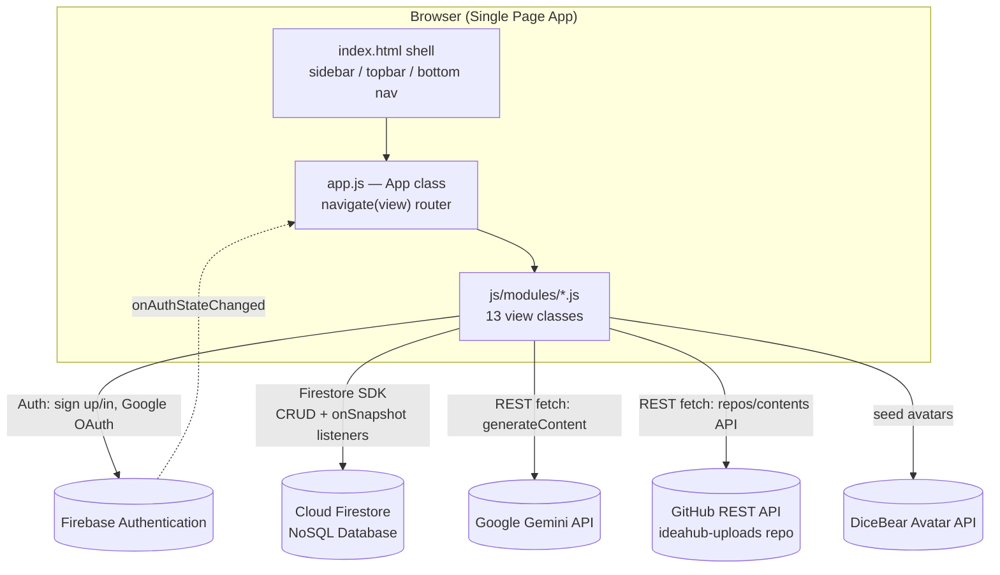
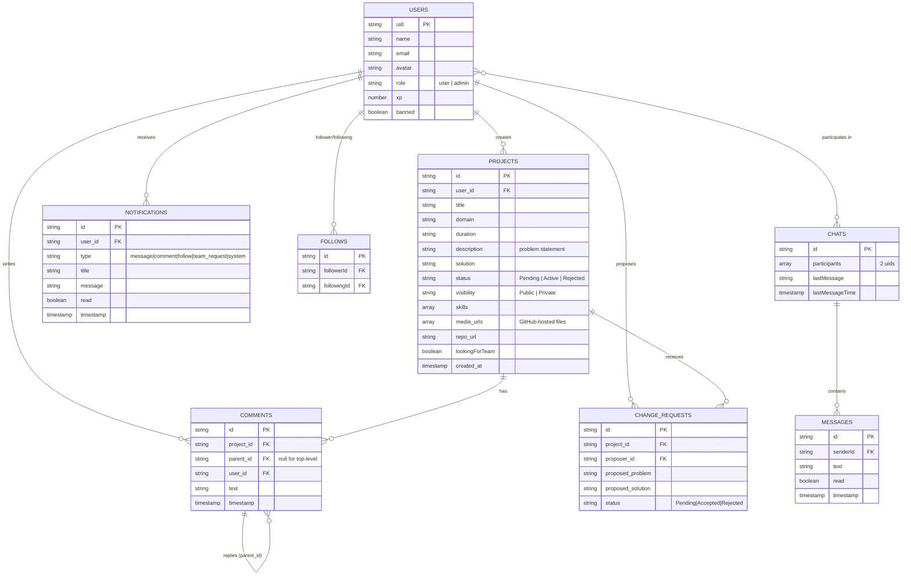
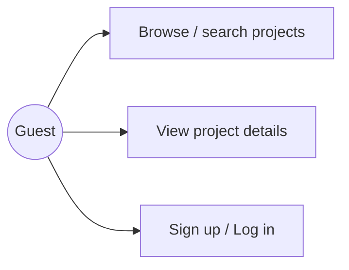
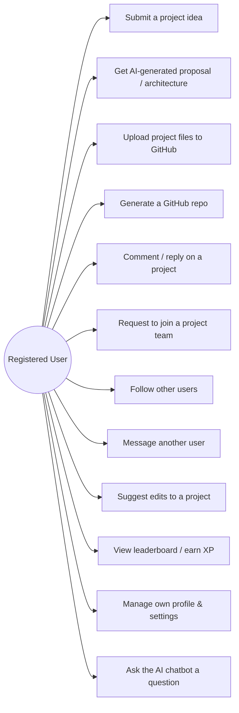
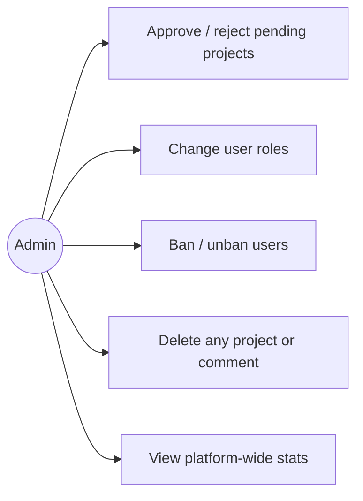

# IdeaHub

**IdeaHub** is a single-page web platform where students and developers can pitch project ideas, get an AI-generated architecture/proposal, find teammates, and manage everything (files, discussion, moderation) around a project — all from one dashboard-style UI.

Built as a **vanilla JavaScript SPA** (no React/Vue/Angular) on top of **Firebase** (Auth + Firestore), the **Google Gemini API** (AI features), and the **GitHub REST API** (used as a free file-hosting / version-control backend for project uploads).

---

## Table of Contents

1. [Team & Ownership](#team--ownership)
2. [Technology Stack](#technology-stack)
3. [System Design](#system-design)
4. [Project Structure](#project-structure)
5. [Database Design](#database-design)
6. [Use Cases](#use-cases)
7. [User Interface](#user-interface)
8. [Core Feature Walkthrough](#core-feature-walkthrough)
9. [Setup & Installation](#setup--installation)
10. [Known Limitations & Security Notes](#known-limitations--security-notes)

---

## Team & Ownership

| Member | Area | Primary Files |
|---|---|---|
| **Maruf. A.K** | Frontend UI/UX + GitHub Integration + Admin Panel (+ light backend) | `index.html`, `js/app.js` (router/shell), `js/modules/submission.js` (form + GitHub upload), `js/modules/projectDetails.js` (page UI + repo gen/file manager/ZIP download), `js/modules/settings.js`, `js/modules/myProjects.js`, `js/modules/dashboard.js`, `js/modules/pendingProjects.js` |
| **M. Naser** | Frontend UI/UX + Real-Time Listeners (+ light backend) | `js/modules/home.js`, `js/modules/discovery.js`, `js/modules/leaderboard.js`, `js/modules/profile.js`, `styles/main.css`, `js/app.js` (`initNotifications`), `js/modules/messages.js` |
| **M.D. Aziz** | Backend / Authentication | `js/config.js`, `js/app.js` (`checkSession`, `loadUserProfile`, `window.awardXP`), `js/modules/login.js`, `js/modules/adminLogin.js` |
| **K.M.R Tahim** | AI Integration | `js/modules/submission.js` (AI Architect), `js/modules/projectDetails.js` (AI README), `js/app.js` (chatbot), `ai_api_requirements.md`, `api_checklist.md` |

> This split is organized by feature area, not by git history (the project folder isn't a git repo with per-commit authorship). `supabase_schema.sql` is a documented, unowned design artifact (see [Database Design](#database-design)) rather than any one member's file. Individual walkthrough documents for each member go into much more depth on their section.

---

## Technology Stack

| Layer | Choice | Notes |
|---|---|---|
| Structure | HTML5 | Single shell page (`index.html`), one `<div id="app-root">` mount point |
| Styling | CSS3 (custom, no framework) | CSS variables, Flexbox/Grid, "glassmorphism" (`backdrop-filter: blur()`), dark theme, mobile media queries |
| Logic | Vanilla JavaScript (ES6 classes) | No build step, no bundler — plain `<script>` tags |
| Auth + Database | **Firebase Auth** + **Cloud Firestore** (compat SDK v10.8.0, loaded via CDN) | Email/password, Google OAuth, NoSQL document store, real-time listeners |
| AI | **Google Gemini API** (`gemini-3.5-flash` / `gemini-1.5-flash`, REST `generateContent`) | Auto-fills proposals, scores project scope, drives the floating chatbot, generates READMEs |
| File hosting | **GitHub REST API** | User's uploaded files are committed to a shared `ideahub-uploads` repo via the Contents API (used instead of Firebase Storage) |
| Avatars | DiceBear API | Deterministic avatar generation from a name/email seed |
| Client utilities | JSZip (CDN), Boxicons (CDN), Google Fonts (Inter, Outfit) | ZIP packaging for downloads, iconography, typography |
| Alternate DB design | **Supabase (PostgreSQL)** schema — `supabase_schema.sql` | A relational schema with Row-Level Security, provided as a documented migration path off Firebase (not wired into the running app) |

---

## System Design

### High-level architecture



### How navigation works (SPA routing)

There is no server-side routing and no page reloads. `index.html` is a static **shell** containing the sidebar, topbar, mobile bottom nav, and one empty mount point: `<div id="app-root">`.

1. `app.js` instantiates one JS class per view (`HomeModule`, `DiscoveryModule`, `SubmissionModule`, …) into a `views` map keyed by name (`'discovery'`, `'submit'`, `'project'`, …).
2. Every `.nav-link` click is intercepted (`e.preventDefault()`), and `App.navigate(viewName, params)` runs.
3. `navigate()` clears `#app-root`, calls `views[viewName].render(params)` (returns a DOM node built from a template string), appends it, then calls `afterRender(params)` if the module defines one (used for anything that needs the node to already be in the DOM, e.g. async Firestore fetches).
4. The URL hash (`#discovery`, `#submit`, …) is updated so a refresh doesn't always dump the user back to the home page.
5. `App.checkSession()` listens to `firebase.auth().onAuthStateChanged()` and redirects between `home` / `login` / `discovery` depending on auth state, and enforces which view names are public (`home`, `login`, `admin-login`, `discovery`, `project`) vs. require a signed-in user.

### Role-Based Access Control (RBAC)

Every user document in Firestore has a `role` field (`'user'` or `'admin'`). `App.loadUserProfile()` reads this after login and:
- shows/hides the **Dashboard** and **Pending Queue** sidebar links,
- gates admin-only UI (approve/reject buttons, ban toggle, comment deletion) behind `window.currentUser.role === 'admin'` checks scattered through the relevant modules,
- `adminLogin.js` additionally signs the user back out if they authenticate through the admin portal without an `admin` role.

### Real-time data flow

Instead of polling, several views subscribe to Firestore's `onSnapshot()` listeners so the UI updates live when data changes elsewhere:
- Notification bell badge and dropdown (`app.js`)
- Pending-queue sidebar badge count (admins only)
- Project comment threads (`projectDetails.js`)
- Chat message list and chat list (`messages.js`)

---

## Project Structure

```
Ideahub-Final-main/
├── index.html                  # App shell: sidebar, topbar, bottom nav, chat widget, script tags
├── styles/
│   └── main.css                 # Design system: CSS variables, glassmorphism, responsive layout
├── js/
│   ├── config.js                 # Firebase init + (obfuscated) API keys for Gemini/GitHub
│   ├── data.js                   # Static MOCK_DATA used before/without a live DB connection
│   ├── app.js                    # App class: router, session/auth, notifications, AI chatbot widget
│   └── modules/
│       ├── home.js                # Public landing page
│       ├── login.js                # Email/password + Google sign-in/sign-up
│       ├── adminLogin.js           # Separate admin-only login portal
│       ├── discovery.js            # Browse/search/filter all active projects
│       ├── myProjects.js           # Current user's own submitted projects
│       ├── pendingProjects.js      # Admin moderation queue (approve/reject)
│       ├── submission.js           # New project form + AI Architect + GitHub file upload
│       ├── projectDetails.js       # Full project page: spec, team, comments, GitHub tools
│       ├── dashboard.js            # Admin panel: user management, project directory
│       ├── leaderboard.js          # XP ranking table
│       ├── profile.js              # Public profile: follow, message, showcased projects
│       ├── messages.js             # Real-time 1:1 chat
│       └── settings.js             # Profile editing, logout, ZIP data export
├── supabase_schema.sql          # Alternative relational (Postgres) schema with RLS policies
├── ai_api_requirements.md       # Research notes: what a "real" AI backend would need
└── api_checklist.md             # Actionable checklist of third-party APIs to register for
```

---

## Database Design

The running app uses **Cloud Firestore** (schemaless NoSQL). Documents are grouped into logical collections that behave like tables. `supabase_schema.sql` documents an equivalent **relational** design (PostgreSQL + Row-Level Security) as the intended migration target if the project moved off Firebase — it defines `profiles` and `projects` tables with `auth.users` foreign keys and RLS policies, but is not currently connected to the app at runtime.

### Entity-Relationship Diagram (conceptual — Firestore collections modeled relationally)



### Collection reference

| Collection | Purpose | Written by |
|---|---|---|
| `users` | Profile, role, XP, ban flag | `login.js` (create on signup), `settings.js` (edit), `dashboard.js` (role/ban) |
| `projects` | Submitted ideas/projects | `submission.js` (create), `dashboard.js` / `pendingProjects.js` (status), `projectDetails.js` (edits, delete) |
| `comments` | Flat collection, self-referencing via `parent_id` for one level of replies | `projectDetails.js` |
| `notifications` | Per-user activity feed (also drives XP-award messages, team-join requests) | `app.js` (`awardXP`), `submission.js`, `projectDetails.js`, `profile.js`, `messages.js` |
| `follows` | Join table between two `users` | `profile.js` |
| `chats` / `chats/{id}/messages` | 1:1 conversations, `messages` is a Firestore **subcollection** | `messages.js`, `profile.js` (chat creation) |
| `change_requests` | Community-suggested edits to a project's problem/solution text, reviewed by the owner | `projectDetails.js` |

`data.js` additionally exposes a static `window.MOCK_DATA` object (sample projects/filters) used for early prototyping before Firestore was wired in — most live views now read from Firestore instead.

---

## Use Cases

Three actors, grouped separately for readability — each higher role also has access to everything the role above it can do (Registered User ⊇ Guest, Admin ⊇ Registered User).

**Guest**



**Registered User** *(also does everything a Guest can)*



**Admin** *(also does everything a User can)*



---

## User Interface

- **Design language:** dark theme, "glassmorphism" panels (`background: rgba(...)` + `backdrop-filter: blur(12px)`), violet/indigo primary (`#6366f1`) with an emerald accent (`#10b981`) for success/active states, defined once as CSS variables in `styles/main.css` and reused across every module's injected `<style>` block.
- **Layout shell (desktop):** fixed left sidebar (nav + user card) + topbar (search with `Ctrl/Cmd+K` shortcut, notification bell, "New Project" button) + scrollable content area.
- **Layout shell (mobile, ≤768px):** sidebar collapses behind a hamburger menu; a native-app-style **bottom navigation bar** (Discover / Projects / floating "+" Submit button / Messages / Profile) replaces it, per rules in `main.css`'s media queries and view-specific mobile handling in `messages.js`.
- **Key screens:** Home (public landing), Login/Admin Login, Discovery (grid + filters), Project Details (spec, team board, discussion, GitHub tools), Submission (form + AI sidebar), My Projects, Pending Queue, Dashboard (admin tables), Leaderboard, Profile, Messages (2-pane chat), Settings.
- **Micro-interactions:** fade-in transitions on view swap, animated pulse dot on the AI panel, sticky filter/AI sidebars, hover-elevate project cards, skeleton/spinner loading states on every async fetch.

---

## Core Feature Walkthrough

### 1. AI Architect (Submission flow)
`submission.js` sends the user's rough idea to Gemini's `generateContent` endpoint with a prompt that forces a strict JSON response (title/domain/problem/solution, or warning/stack), strips any accidental Markdown code fences, `JSON.parse()`s it, and writes the values straight into the form fields / suggested-stack tags. The same pattern (prompt → fetch → strip fences → parse → render) is reused by the floating chatbot in `app.js` and by the "AI README" generator in `projectDetails.js`.

### 2. GitHub-as-storage
Firebase Storage isn't used; instead, `submission.js`, `projectDetails.js`, and `settings.js` treat one shared GitHub repo (`ideahub-uploads`) as a file store via the **Contents API**: files are base64-encoded client-side and `PUT` to `contents/{user}/{project}/{filename}`, namespaced per user/project. `projectDetails.js` builds a full in-browser file manager (browse/rename/copy/move/delete folders) entirely on top of GitHub Contents `GET`/`PUT`/`DELETE` calls, and `JSZip` bundles files client-side for one-click ZIP downloads.

### 3. Real-time everything
Firestore's `onSnapshot()` is used instead of manual refresh/polling for notifications, the pending-queue badge, project comments, and chat — each view subscribes on `afterRender`/`render` and unsubscribes when navigating away to avoid leaked listeners.

### 4. Gamification (XP)
`window.awardXP(uid, amount, reason)` (defined globally in `app.js`) increments a user's `xp` field and drops a notification; it's called from `dashboard.js` and `pendingProjects.js` when an admin approves a submission, and feeds the `leaderboard.js` ranking table.

---

## Setup & Installation

This is a static, buildless app — no `npm install` or bundler required.

1. Clone/download the repo and open the folder.
2. Create a Firebase project, enable **Authentication** (Email/Password + Google) and **Cloud Firestore**, then paste your config into `js/config.js` (`FIREBASE_CONFIG`).
3. Get a **Google Gemini API key** ([aistudio.google.com](https://aistudio.google.com/)) and a **GitHub Personal Access Token** (repo scope) and set them in `js/config.js`.
4. (Optional) If migrating to Supabase/Postgres instead of Firestore, run `supabase_schema.sql` in the Supabase SQL editor.
5. Serve `index.html` with any static file server (e.g. `npx serve .` or the VS Code "Live Server" extension) — opening it via `file://` will work for most of the UI but CORS/security rules on some browsers can interfere with Firebase.

---

## Known Limitations & Security Notes

- **API keys are shipped to the browser.** `config.js` stores the Gemini key, GitHub token, and Firebase config client-side (the GitHub token and Gemini key are Base64-"obfuscated," which is **not encryption** — anyone can decode them from dev tools). This is acceptable for a class prototype but is explicitly called out in `ai_api_requirements.md`/`api_checklist.md` as something a production build must fix by routing AI/GitHub calls through a backend (serverless function) that holds the real secrets. **Rotate these keys before making the repository public.**
- **Firestore security rules** aren't included in this repo; RBAC is currently enforced client-side (hiding buttons) rather than with server-side Firestore rules, so the `supabase_schema.sql` Row-Level Security policies are the more production-representative access-control design.
- **No automated tests** — this is a UI prototype; verification is manual, in-browser.
- **Duplicate-detection / vector search / auto repo scaffolding** described in `ai_api_requirements.md` are documented as a roadmap, not implemented.
